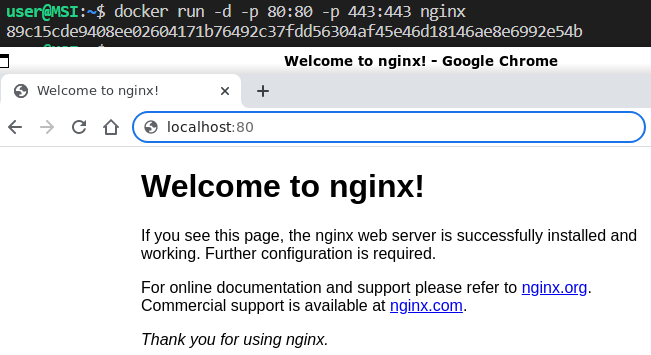

1. [Готовый докер](#part-1-готовый-докер) 
2. [Операции с контейнером](#part-2-операции-с-контейнером)
3. [Мини веб-сервер](#part-3-мини-веб-сервер)

- Для начала работы над проектом, необходимо скачать докер с [официального сайта](https://docs.docker.com/get-docker/), следуя инструкции (в зависимости от ОС).- Чтобы  каждый раз не вводить "sudo" при запуске команды docker, можно добавить имя пользователя в группу docker -`sudo usermod -aG docker ${USER}`. Далее, чтобы применить добавление нового члена группы - `su - ${USER}`.

## Part 1. Готовый докер

- Для скачивания официального докер образа с nginx используется команда `sudo docker pull nginx`.
- Для проверки наличия докер образа - `sudo docker images`.
- Для запуска докер образа - `sudo docker run -d 51086ed63d8c` (image ID).
- Проверить, что образ запустился, можно, используя команду `sudo docker ps`. \
 \
Вызов и вывод команд `sudo docker pull nginx`, `sudo docker images`, `sudo docker run -d 51086ed63d8c`, `sudo docker ps`
- Чтобы посмотреть информацию о контейнере, надо использовать команду `sudo docker inspect -s keen_fermi` (имя контейнера). \
 \
Вызов и вывод команды `sudo docker inspect -s keen_fermi`
- Из вывода можно определить:
	1. Размер контейнера - "SizeRootFs" - 141678969 байт,  "SizeRw": 1095байт;
	2. Список замапленных портов - 80 порт;
	3. Ip контейнера - 172.17.0.2.
- Пояснение к размеру контейнера:
1) SizeRootFs - общий размер всех файлов в контейнере в байтах. Если бы вы экспортировали файловую систему контейнера в виде архива, она была бы примерно такого размера;
2) SizeRw - размер файлов, которые были созданы или изменены, если сравнить контейнер с его базовым образом. Сразу после создания это должно быть равно нулю; по мере того, как вы изменяете (или создаете) файлы, это значение будет увеличиваться.
- Так как в выводе команды  `docker inspect -s` очень много данных, для удобства можно использовать команды, чтобы отфильтровать необходимые значения:
	1. `docker inspect -s keen_fermi | grep -i size` - для вывода размера контейнера;
	2. `docker inspect --format '{{ .NetworkSettings.Ports }}' $(docker ps -q)` - для вывода замапленных портов;
	3. `docker inspect --format '{{ .NetworkSettings.IPAddress }}' $(docker ps -q)` - для вывода Ip контейнера. \
 \
Вызов и вывод команд `docker inspect -s keen_fermi | grep -i size`, `docker inspect --format '{{ .NetworkSettings.Ports }}' $(docker ps -q)`, `docker inspect --format '{{ .NetworkSettings.IPAddress }}' $(docker ps -q)`
- Остановить докер образ через `sudo docker stop keen_fermi` (имя контейнера).
- Проверить, что образ остановился можно через `sudo docker ps`. \
 \
Остановка докер образа и проверка, что он остановился
- Чтобы запустить докер с замапленными портами 80 и 443 на локальную машину используется команда `docker run -p -d 80:80 -d 443:443 nginx`.
- Теперь при проверке в браузере по адресу localhost:80 доступна стартовая страница nginx. \
 \
Вызов и вывод команды `docker run -d -p 80:80 -p 443:443 nginx` (верхний снимок) и стартовая страница nginx (нижний снимок)
- Для того чтобы перезапустить докер контейнер, командой `docker ps` можно посмотреть "CONTAINER ID"и далее использовать его в команде `docker restart 89c15cde9408`. После этого вновь использовать команду `docker ps` из которой видно, что контейнер 89c15cde9408 запущен 7 секунд назад. \
 \
Вызов и вывод команды `docker ps` (2 раза) и `docker restart 89c15cde9408`
[В начало](#part-1-готовый-докер)

## Part 2. Операции с контейнером
- Чтобы прочитать конфигурационный файл nginx.conf внутри докер контейнера можно использовать команду `docker exec strange_almeida cat /etc/nginx/nginx.conf`. 
 \
Вызов и вывод команды `docker exec strange_almeida cat /etc/nginx/nginx.conf` для чтения конфигурационного файла nginx.conf внутри докер контейнера 
- Для удобства можно скопировать файл "nginx.conf" из контейнера docker на локальную машину командой `docker cp strange_almeida:/etc/nginx/nginx.conf ~/docker/config_nginx` (где "~/docker/config_nginx" - путь до текущей папки). \
 \
Копирование файла "nginx.conf" из контейнера docker на локальную машину
- Необходимо отредактировать файл "nginx.conf" - добавить новый блок "server" с параметрами директив "location", убрать ссылку на файл "default.conf" из папки "conf.d". \
 \
Содержимое файла "nginx.conf" на локальной машине после внесения изменений
-  Чтобы скопировать созданный файл "nginx.conf" внутрь докер образа можно использовать команду `docker cp ./nginx.conf 89c15cde9408:/etc/nginx/`.
- Далее переапустить nginx внутри докер образа через команду `docker exec 89c15cde9408 nginx -s reload`.
- В браузере по адресу " localhost:80/status" отдаётся страничка со статусом сервера nginx. \
 \
Копирование файла "nginx.conf" с локальной машины внутрь докер образа и переапуск nginx(верхнее изображение), cтраница в браузере со статусом nginx (нижнее изображение)
- Для экспорта контейнера в файл "container.tar" можно использовать команду `docker export -o container.tar 89c15cde9408` ("CONTAINER ID").
- Остановить контейнер - `docker stop 89c15cde9408` ("CONTAINER ID"). \
 \
Вызов и вывод команд для экспорта контейнера и остановки контейнера
- Чтобы удалить образ, не удаляя перед этим контейнеры, используется команда  `docker rmi` с флагом - f:  `docker rmi -f 51086ed63d8c` ("IMAGE ID"). \
 \
Вызов и вывод команды для удаления докер образа
- Для удаления остановленного контейнера команда `docker ps --filter status=exited -q | xargs docker rm`. \
 \
Вызов и вывод команды для удаления остановленного докер контейнера
- Импортировать контейнер обратно можно через команду `docker import -c 'CMD ["nginx", "-g", "daemon off;"]' container.tar s21_nginx`.
- Для запуска импортированного контейнера `docker run -d -p 80:80 -p 443:443 nginx`.
- Далее в браузере можно проверить, что  по адресу localhost:80/status отдается страничка со статусом сервера nginx. \
 \
Вызов и вывод команды для импорта и запуска докер контейнера (верхнее изображение), cтраница в браузере со статусом nginx (нижнее изображение)
- [В начало](#part-1-готовый-докер)

## Part 3. Мини веб-сервер
- Для установки компилятора GCC, Spawn-fcgi, Libfcgi-dev и systemctl (при необходимости) можно запустить скрипт  "install.sh".
- Для запуска мини веб-сервера - скрипт "part3.sh". Далее можно командой `curl http://localhost:81` проверить, запустился ли веб-сервер (вывод команды - "<h1>Hello World!</h1>").
- Работу веб-сервера по part3, сборку докер образа по part4, пример проверки образа из предыдущего задания через dockle и сборку и запуск проекта с помощью файла docker-compose.yml можно посмотреть [здесь](https://drive.google.com/drive/folders/1c4Ilfsus4TUqgx7yBXyhRGnZ0sV2bWh-?usp=share_link). 
- [В начало](#part-1-готовый-докер).

